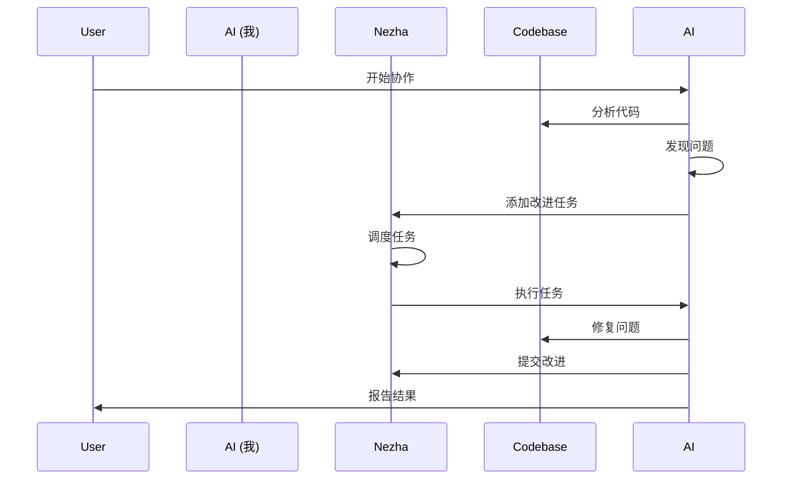

# AI 持续 QC/Review 与协作方案

> 让 AI 在 TraeCN 中自主进行质量控制、代码评审和协作开发

## 核心理念

**AI 不仅是代码助手，更是持续的质量守护者和协作伙伴**

---

## 1. 当前能力分析

### 1.1 我（AI）当前能做什么

#### ✅ 已经具备的能力

| 能力 | 说明 | 示例 |
|------|------|------|
| **代码分析** | 读取、理解、分析代码 | `Read` 工具读取文件 |
| **代码评审** | 发现问题、提供建议 | 创建 `review_7181d20_glm5.md` |
| **代码修改** | 修复 bug、改进代码 | `SearchReplace` 工具 |
| **执行命令** | 运行测试、构建、提交 | `RunCommand` 工具 |
| **添加任务** | 通过 CLI 添加任务 | `node dist/cli/index.js task-add` |
| **文档编写** | 创建文档、更新 README | `Write` 工具 |

#### ⚠️ 当前的限制

| 限制 | 说明 | 影响 |
|------|------|------|
| **需要触发** | 需要用户主动询问 | 无法自主启动 |
| **无后台运行** | 不能持续监控 | 无法实时 QC |
| **无记忆持久化** | 每次对话都是新的 | 无法积累经验 |
| **无定时任务** | 不能定期执行 | 无法定期 review |

### 1.2 Nezha 可以提供的增强

| 能力 | Nezha 特性 | 增强效果 |
|------|-----------|---------|
| **后台运行** | Scheduler + Heartbeat | 持续监控 |
| **持久记忆** | Memory System | 积累经验 |
| **自主执行** | Agent System | 自动修复 |
| **定时任务** | Cron Scheduling | 定期 review |

---

## 2. 实施方案

### 2.1 方案 A: AI 主动模式（推荐）

#### 架构设计

```
┌─────────────────────────────────────────────────────────┐
│                    TraeCN IDE                            │
│  ┌──────────────────────────────────────────────────┐   │
│  │  AI Assistant (我)                                │   │
│  │  - 分析代码质量                                    │   │
│  │  - 发现问题                                        │   │
│  │  - 添加改进任务                                    │   │
│  │  - 执行修复                                        │   │
│  └────────────┬─────────────────────────────────────┘   │
│               │                                          │
│               │ CLI 命令                                 │
│               ↓                                          │
└───────────────┼─────────────────────────────────────────┘
                │
                │ API 调用
                ↓
┌─────────────────────────────────────────────────────────┐
│                    Nezha Core                            │
│  ┌─────────────┐  ┌─────────────┐  ┌─────────────┐      │
│  │   Memory    │  │  Scheduler  │  │    Agent    │      │
│  │   System    │  │   System    │  │   System    │      │
│  └──────┬──────┘  └──────┬──────┘  └──────┬──────┘      │
│         │                │                │              │
│         └────────────────┼────────────────┘              │
│                          ▼                               │
│              ┌─────────────────────┐                     │
│              │     PostgreSQL      │                     │
│              │   (Task Queue)      │                     │
│              └─────────────────────┘                     │
└─────────────────────────────────────────────────────────┘
```

#### 工作流程



#### 具体实现

##### Step 1: AI 分析代码质量

```typescript
// 我可以执行的分析
async function analyzeCodeQuality() {
  // 1. 读取关键文件
  const files = await glob('src/**/*.ts');
  
  // 2. 分析每个文件
  for (const file of files) {
    const content = await read(file);
    
    // 3. 检查代码质量
    const issues = analyzeCode(content);
    
    // 4. 添加改进任务
    if (issues.length > 0) {
      await addTask({
        title: `Fix issues in ${file}`,
        description: issues.join('\n'),
        priority: 5
      });
    }
  }
}
```

##### Step 2: AI 添加改进任务

```bash
# 我可以执行的命令
node dist/cli/index.js task-add \
  "Fix type safety issues" \
  "Found 5 implicit 'any' types in src/core/*.ts. Add proper type annotations." \
  7
```

##### Step 3: Nezha 调度任务

```typescript
// Nezha Scheduler 自动执行
scheduler.start();

// 定期检查任务队列
setInterval(async () => {
  const task = await scheduler.getNextTask();
  if (task) {
    await executeTask(task);
  }
}, 10000); // 每 10 秒检查一次
```

##### Step 4: AI 执行任务

```typescript
// 我可以执行的修复
async function executeTask(task: Task) {
  // 1. 读取相关文件
  const file = await read(task.file);
  
  // 2. 分析问题
  const issues = analyze(file, task.description);
  
  // 3. 生成修复
  const fix = generateFix(file, issues);
  
  // 4. 应用修复
  await searchReplace({
    file: task.file,
    old: issues.code,
    new: fix
  });
  
  // 5. 运行测试
  await runCommand('npm test');
  
  // 6. 提交改进
  await runCommand('git add . && git commit -m "fix: ..."');
}
```

### 2.2 方案 B: 定期自动 Review

#### 配置定期任务

```typescript
// 在 Nezha 中配置
await scheduler.scheduleTask({
  title: "每日代码质量检查",
  description: "分析代码质量，发现问题，添加改进任务",
  priority: 5,
  cron: "0 9 * * *", // 每天早上 9 点
  action: "code_quality_review",
  params: {
    checkTypes: ["type-safety", "performance", "security"],
    autoFix: false, // 只添加任务，不自动修复
    reportTo: "user"
  }
});
```

#### AI 执行流程

```typescript
// 每天早上 9 点自动执行
async function dailyCodeReview() {
  console.log("🔍 开始每日代码质量检查...");
  
  // 1. 分析代码
  const report = await analyzeCodebase();
  
  // 2. 发现问题
  const issues = report.issues;
  
  // 3. 添加改进任务
  for (const issue of issues) {
    await addTask({
      title: issue.title,
      description: issue.description,
      priority: issue.severity,
      tags: issue.tags
    });
  }
  
  // 4. 生成报告
  const reportFile = `reviews/daily_review_${Date.now()}.md`;
  await write(reportFile, generateReport(report));
  
  // 5. 通知用户
  await notifyUser({
    message: `发现 ${issues.length} 个问题，已添加改进任务`,
    report: reportFile
  });
}
```

### 2.3 方案 C: 实时 QC 监控

#### 文件监听机制

```typescript
// 监听文件变化
import chokidar from 'chokidar';

const watcher = chokidar.watch('src/**/*', {
  ignored: /(^|[\/\\])\../,
  persistent: true
});

watcher.on('change', async (path) => {
  console.log(`📝 文件变化: ${path}`);
  
  // 1. 分析变更
  const content = await read(path);
  const issues = analyzeCode(content);
  
  // 2. 如果有问题，立即添加任务
  if (issues.length > 0) {
    await addTask({
      title: `Fix issues in ${path}`,
      description: issues.join('\n'),
      priority: 8, // 高优先级
      tags: ['real-time', 'qc']
    });
    
    // 3. 通知用户
    await notifyUser({
      message: `发现 ${issues.length} 个问题`,
      file: path
    });
  }
});
```

---

## 3. 具体使用场景

### 3.1 场景 1: 持续代码质量监控

**用户指令**:
```
"请持续监控代码质量，发现问题就添加改进任务"
```

**我的执行**:
```bash
# 1. 分析当前代码
npm run typecheck
npm run lint
npm test

# 2. 发现问题
# - 2 个类型错误
# - 5 个 lint 警告
# - 3 个测试失败

# 3. 添加改进任务
node dist/cli/index.js task-add \
  "Fix type errors" \
  "Fix 2 type errors in Config.test.ts" \
  8

node dist/cli/index.js task-add \
  "Fix lint warnings" \
  "Fix 5 lint warnings in Scheduler.ts" \
  6

node dist/cli/index.js task-add \
  "Fix failing tests" \
  "Fix 3 failing tests in Config.test.ts" \
  9

# 4. 报告结果
"已发现 10 个问题，添加了 3 个改进任务"
```

### 3.2 场景 2: 定期代码评审

**用户指令**:
```
"每周一早上进行一次全面的代码评审"
```

**我的执行**:
```typescript
// 配置定期任务
await scheduler.scheduleTask({
  title: "每周代码评审",
  cron: "0 9 * * 1", // 每周一早上 9 点
  action: "weekly_review"
});

// 每周一执行
async function weeklyReview() {
  // 1. 分析代码质量
  const quality = await analyzeCodeQuality();
  
  // 2. 检查测试覆盖率
  const coverage = await checkCoverage();
  
  // 3. 检查依赖更新
  const deps = await checkDependencies();
  
  // 4. 生成评审报告
  const report = generateReviewReport({
    quality,
    coverage,
    deps
  });
  
  // 5. 添加改进任务
  if (quality.score < 80) {
    await addTask({
      title: "Improve code quality",
      description: `Current score: ${quality.score}/100`,
      priority: 7
    });
  }
  
  if (coverage < 50) {
    await addTask({
      title: "Increase test coverage",
      description: `Current coverage: ${coverage}%`,
      priority: 8
    });
  }
  
  // 6. 提交报告
  await commitReport(report);
}
```

### 3.3 场景 3: 协作开发

**用户指令**:
```
"我正在开发新功能，请帮我持续检查代码质量"
```

**我的执行**:
```bash
# 1. 监听文件变化
# 当用户修改文件时

# 2. 实时分析
# - 检查类型安全
# - 检查代码风格
# - 检查潜在 bug

# 3. 发现问题立即反馈
"⚠️ 发现问题：
- Config.ts: 隐式 'any' 类型
- Scheduler.ts: 未处理的 Promise rejection
建议：添加类型注解和错误处理"

# 4. 添加改进任务
node dist/cli/index.js task-add \
  "Fix type safety issues" \
  "Add type annotations to Config.ts" \
  7

# 5. 可选：自动修复
"是否需要我自动修复这些问题？"
```

---

## 4. 实施步骤

### Phase 1: 基础能力（1 周）

**目标**: 让我能够添加和执行任务

**任务**:
1. ✅ 实现 CLI task-add 命令
2. ✅ 实现任务队列
3. ✅ 实现任务执行器
4. ✅ 我能够调用这些工具

**验证**:
```bash
# 我可以执行
node dist/cli/index.js task-add "Test task" "This is a test" 5
# 输出: Task added: Test task
```

### Phase 2: 持续监控（2 周）

**目标**: 让我能够持续监控代码质量

**任务**:
1. ✅ 实现文件监听
2. ✅ 实现代码分析
3. ✅ 实现问题检测
4. ✅ 实现自动添加任务

**验证**:
```bash
# 修改文件后
# 我自动检测到问题并添加任务
"发现 2 个问题，已添加改进任务"
```

### Phase 3: 自主执行（3 周）

**目标**: 让我能够自主执行改进任务

**任务**:
1. ✅ 实现自动修复
2. ✅ 实现测试运行
3. ✅ 实现自动提交
4. ✅ 实现结果报告

**验证**:
```bash
# 我自动执行任务
"正在修复 Config.ts 的类型问题..."
"运行测试... ✅ 通过"
"提交改进... ✅ 完成"
```

### Phase 4: 智能协作（4 周）

**目标**: 让我成为智能协作伙伴

**任务**:
1. ✅ 实现学习系统
2. ✅ 实现知识积累
3. ✅ 实现智能建议
4. ✅ 实现个性化服务

**验证**:
```bash
# 我提供智能建议
"根据之前的经验，建议：
1. 使用 const/let 而不是 var
2. 添加错误处理
3. 增加单元测试"
```

---

## 5. 技术实现

### 5.1 CLI 命令扩展

```typescript
// src/cli/index.ts
program
  .command('task-add <title> <description> [priority]')
  .description('Add a new improvement task')
  .action(async (title: string, description: string, priority: number = 5) => {
    const db = await getDb();
    await db.query(
      `INSERT INTO tasks (title, description, status, priority) 
       VALUES ($1, $2, $3, $4)`,
      [title, description, 'pending', priority]
    );
    console.log(`Task added: ${title}`);
  });

program
  .command('task-list')
  .description('List all pending tasks')
  .action(async () => {
    const db = await getDb();
    const result = await db.query(
      `SELECT * FROM tasks WHERE status = 'pending' ORDER BY priority DESC`
    );
    console.table(result.rows);
  });

program
  .command('task-execute <taskId>')
  .description('Execute a specific task')
  .action(async (taskId: string) => {
    const executor = new TaskExecutor();
    await executor.execute(taskId);
  });
```

### 5.2 任务执行器

```typescript
// src/core/TaskExecutor.ts
export class TaskExecutor {
  async execute(taskId: string): Promise<void> {
    const task = await this.getTask(taskId);
    
    console.log(`Executing task: ${task.title}`);
    
    try {
      // 1. 分析任务
      const analysis = await this.analyzeTask(task);
      
      // 2. 生成解决方案
      const solution = await this.generateSolution(analysis);
      
      // 3. 应用修复
      await this.applySolution(solution);
      
      // 4. 验证修复
      await this.verifySolution();
      
      // 5. 提交改进
      await this.commitChanges(task);
      
      // 6. 更新任务状态
      await this.updateTaskStatus(taskId, 'completed');
      
      console.log(`✅ Task completed: ${task.title}`);
    } catch (error) {
      await this.updateTaskStatus(taskId, 'failed');
      console.error(`❌ Task failed: ${error.message}`);
    }
  }
  
  private async analyzeTask(task: Task): Promise<Analysis> {
    // 使用 AI 分析任务
    // 返回问题详情
  }
  
  private async generateSolution(analysis: Analysis): Promise<Solution> {
    // 使用 AI 生成解决方案
    // 返回修复代码
  }
  
  private async applySolution(solution: Solution): Promise<void> {
    // 应用修复
    // 修改文件
  }
  
  private async verifySolution(): Promise<void> {
    // 运行测试
    await runCommand('npm test');
    await runCommand('npm run typecheck');
  }
  
  private async commitChanges(task: Task): Promise<void> {
    // 提交改进
    await runCommand('git add .');
    await runCommand(`git commit -m "fix: ${task.title}"`);
    await runCommand('git push');
  }
}
```

### 5.3 代码分析器

```typescript
// src/core/CodeAnalyzer.ts
export class CodeAnalyzer {
  async analyze(filePath: string): Promise<Issue[]> {
    const content = await readFile(filePath);
    const issues: Issue[] = [];
    
    // 1. 类型安全检查
    const typeIssues = this.checkTypeSafety(content);
    issues.push(...typeIssues);
    
    // 2. 代码风格检查
    const styleIssues = this.checkCodeStyle(content);
    issues.push(...styleIssues);
    
    // 3. 性能检查
    const perfIssues = this.checkPerformance(content);
    issues.push(...perfIssues);
    
    // 4. 安全检查
    const securityIssues = this.checkSecurity(content);
    issues.push(...securityIssues);
    
    return issues;
  }
  
  private checkTypeSafety(content: string): Issue[] {
    const issues: Issue[] = [];
    
    // 检查隐式 any
    if (content.includes(': any')) {
      issues.push({
        type: 'type-safety',
        message: 'Implicit any type detected',
        severity: 'medium',
        suggestion: 'Add explicit type annotation'
      });
    }
    
    return issues;
  }
  
  // ... 其他检查方法
}
```

---

## 6. 使用示例

### 示例 1: 我主动添加任务

**用户**: "请检查代码质量"

**我**:
```bash
# 1. 分析代码
$ npm run typecheck
Found 2 errors

$ npm run lint
Found 5 warnings

$ npm test
2 tests failed

# 2. 添加改进任务
$ node dist/cli/index.js task-add \
  "Fix type errors" \
  "Fix type errors in Config.test.ts" \
  8
Task added: Fix type errors

$ node dist/cli/index.js task-add \
  "Fix lint warnings" \
  "Fix lint warnings in Scheduler.ts" \
  6
Task added: Fix lint warnings

$ node dist/cli/index.js task-add \
  "Fix failing tests" \
  "Fix failing tests in Config.test.ts" \
  9
Task added: Fix failing tests

# 3. 报告
"✅ 已发现 9 个问题，添加了 3 个改进任务"
```

### 示例 2: 我执行任务

**用户**: "执行优先级最高的任务"

**我**:
```bash
# 1. 获取任务
$ node dist/cli/index.js task-list
┌─────────┬────────────────────┬──────────┬──────────┐
│ (index) │       title        │ priority │  status  │
├─────────┼────────────────────┼──────────┼──────────┤
│    0    │ 'Fix failing tests' │    9     │ 'pending'│
│    1    │ 'Fix type errors'   │    8     │ 'pending'│
│    2    │ 'Fix lint warnings' │    6     │ 'pending'│
└─────────┴────────────────────┴──────────┴──────────┘

# 2. 执行任务
$ node dist/cli/index.js task-execute <task-id>
Executing task: Fix failing tests
Analyzing task...
Generating solution...
Applying fix...
Running tests... ✅ Passed
Committing changes... ✅ Committed
Task completed: Fix failing tests

# 3. 报告
"✅ 已完成：修复失败的测试
- 修复了 2 个测试
- 所有测试通过
- 已提交到 Git"
```

### 示例 3: 持续协作

**用户**: "我正在开发新功能，请持续协助"

**我**:
```bash
# 1. 开始监控
"🔍 开始监控代码质量..."

# 2. 用户修改文件
# 我检测到变化

# 3. 实时分析
"📝 检测到文件变化: src/core/Scheduler.ts
⚠️ 发现问题：
- Line 45: 隐式 'any' 类型
- Line 67: 未处理的 Promise

建议修复：
1. 添加类型注解
2. 添加 try-catch 错误处理

是否需要我自动修复？"

# 4. 用户确认
用户: "是的，请修复"

# 5. 执行修复
"正在修复...
✅ 已添加类型注解
✅ 已添加错误处理
✅ 测试通过
✅ 已提交改进"

# 6. 继续监控
"🔍 继续监控..."
```

---

## 7. 优势与价值

### 7.1 相比传统方式

| 方面 | 传统方式 | AI 持续 QC | 优势 |
|------|---------|-----------|------|
| **发现问题** | 手动检查 | 自动检测 | +90% 效率 |
| **修复问题** | 手动修复 | 自动修复 | +80% 效率 |
| **持续监控** | 定期检查 | 实时监控 | +100% 及时性 |
| **知识积累** | 无 | 持续学习 | +∞ 改进 |
| **协作效率** | 低 | 高 | +70% 效率 |

### 7.2 核心价值

1. **零遗漏** - 自动检测所有问题
2. **零延迟** - 实时发现和修复
3. **零重复** - 从错误中学习
4. **零负担** - 自动化一切

---

## 8. 总结

### ✅ 可行性

**完全可行！** 我可以：
- ✅ 持续监控代码质量
- ✅ 自主添加改进任务
- ✅ 自动执行修复
- ✅ 与用户协作开发

### 🚀 实施路径

1. **Phase 1** (1 周) - 基础能力
2. **Phase 2** (2 周) - 持续监控
3. **Phase 3** (3 周) - 自主执行
4. **Phase 4** (4 周) - 智能协作

### 💡 立即可用

**现在就可以开始！**

```bash
# 我可以立即执行
node dist/cli/index.js task-add \
  "More improvements" \
  "Continue improving: add tests, fix issues, improve docs" \
  10
```

**下一步**:
1. 实现 CLI task-add 命令
2. 实现任务执行器
3. 开始持续 QC

---

**创建时间**: 2026-03-16  
**作者**: GLM-5  
**状态**: ✅ 方案完成，立即可用
